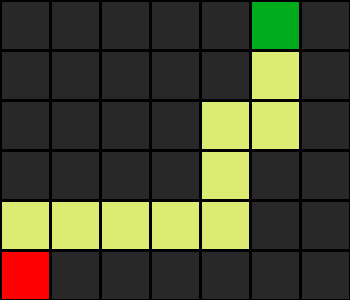

# Maze Solver

This Python script solves a maze using both Depth-First Search (DFS) and Breadth-First Search (BFS) algorithms.

## Features
- Reads maze from a text file
- Visualizes the maze and solution paths

## Usage
1. Create a maze file should contain a grid of ` `s (walkable cells), `#`s (walls), `A` (start postion) and `B` (exit).
2. Clone the Repository:
```bash
git clone https://github.com/yzaazaa/mazeSolver
cd mazeSolver
python3 -m venv venv
source venv/bin/activate # On Windows use `venv\Scripts\activate`
```
3. Install Dependencies

```bash
pip install -r requirements.txt
```
4. Run the script:
```
python maze.py <maze_file_name> <"DFS" or "BFS (optional)>
```

## Algorithms
The script implements two algorithms to solve the maze:

1. **Depth-First Search (DFS)**:
   - Explores as far as possible along each branch before backtracking.
   - Can be implemented using a stack data structure.
   - Tends to find longer paths.

2. **Breadth-First Search (BFS)**:
   - Explores all the neighboring nodes at the present depth before moving on to the nodes at the next depth level.
   - Can be implemented using a queue data structure.
   - Finds the shortest path.

3. **Greedy Breadth-First Search (GBFS)**:
   - A heuristic-based search algorithm that prioritizes nodes based on the estimated cost to the goal (using a heuristic function).
   - It doesn’t guarantee the shortest path, as it may not consider the overall cost, but it can be faster in many cases by focusing on promising paths.

4. **A* algorithm (GBFS)**:
   - An extension of Greedy BFS that combines the best of BFS and Greedy BFS.
   - Uses a heuristic to estimate the cost to the goal (like Greedy BFS), but also accounts for the cost to reach the current node.
   - The formula for the priority is 𝑓(𝑛) = 𝑔(𝑛) + ℎ(𝑛), where 𝑔(𝑛) is the cost to reach the current node, and ℎ(𝑛) is the heuristic estimated cost to the goal.
   - A* guarantees finding the shortest path when an admissible and consistent heuristic is used.

## Example Output
```
Maze: 
 
███                 █████████
█   ███████████████████   █ █
█ ████                █ █ █ █
█ ███████████████████ █ █ █ █
█                     █ █ █ █
█████████████████████ █ █ █ █
█   ██                █ █ █ █
█ █ ██ ███ ██ █████████ █ █ █
█ █    █   ██B█         █ █ █
█ █ ██ ████████████████ █ █ █
███ ██             ████ █ █ █
███ ██████████████ ██ █ █ █ █
███             ██    █ █ █ █
██████ ████████ ███████ █ █ █
██████ ████             █   █
A      ██████████████████████

Solving maze ...
States Explored:  78
Solution:

███                 █████████
█   ███████████████████   █ █
█ ████                █ █ █ █
█ ███████████████████ █ █ █ █
█                     █ █ █ █
█████████████████████ █ █ █ █
█   ██********        █ █ █ █
█ █ ██*███ ██*█████████ █ █ █
█ █****█   ██B█         █ █ █
█ █*██ ████████████████ █ █ █
███*██             ████ █ █ █
███*██████████████ ██ █ █ █ █
███****         ██    █ █ █ █
██████*████████ ███████ █ █ █
██████*████             █   █
A******██████████████████████

Actions:
right
up
left
up
right
up
right
down
```




## Contributing
If you find any issues or have suggestions for improvement, feel free to open an issue or submit a pull request.
